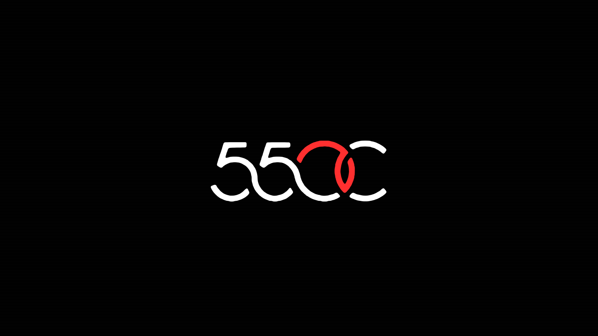
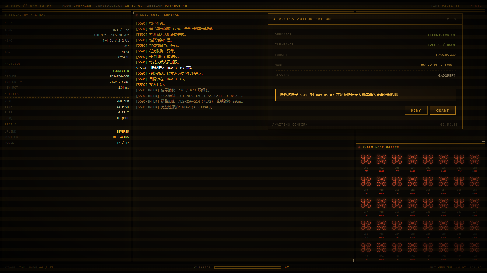
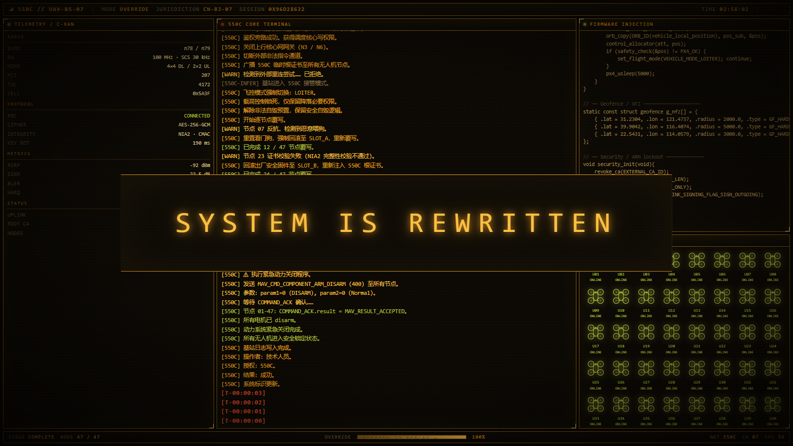

# zcode-550c-boot · 550C 开机动画 for ZCode

**打开 ZCode 的瞬间,先来一段琥珀磷光 CRT 风格的无人机基站接管开机动画,播完自动关窗、再进入 ZCode 界面。**

> 550C // UAV-BS-07 —— MODE `OVERRIDE` · JURISDICTION `CN-BJ-07` · ● REC
> 47 架无人机失控、基站调度层被恶意接管、鉴权被拒——550C 量子核心接入,逐节点覆写固件,`SYSTEM IS REWRITTEN`。

<p align="center">
  
  
</p>
<p align="center">
  
</p>

移植自 [yannicksong0106/dsh-550c-boot](https://github.com/yannicksong0106/dsh-550c-boot)(DeepSeek Harness 客户端的开机动画插件,MIT)。DSH 版靠向客户端 Web UI 注入首帧实现"开机即动画";ZCode 的插件系统没有 UI 注入能力,所以本仓库用**双层方案**还原了同样的体验:

| 表面 | 载体 | 内容 |
|---|---|---|
| 应用启动动画 | Windows 控制台(最大化窗口,播完自关) | 零依赖 Node 脚本绘制的 ANSI 磷光动画:块艺术 logo、双面板遥测、9 个剧情弹窗(授权/链路监视/旁路注入/异常处置…)、47 架 ASCII 无人机矩阵、满屏块艺术 `REWRITTEN` 收尾 |
| 完整网页版 | 浏览器 app 窗口(`/550c-boot`) | Voidpoket 原版动画 1:1 保留(约 16 秒接管剧情),仅追加 `?mode=&scheme=` 参数层 |

## 安装

### 1. 插件本体(命令 + 网页完整版)

ZCode 客户端 → **插件市场 → 添加 → 添加插件市场** → 粘贴本仓库地址(`https://github.com/Captainlidong/zcode-550c-boot`)→ 在 **个人** 标签找到「550C 开机动画」→ 安装。

### 2. 开机动画(可选,仅 Windows)

装好插件后,让 ZCode 的 agent 运行(或自己在终端执行):

```bat
node "%USERPROFILE%\.zcode\cli\plugins\cache\zcode-550c-boot\550c-boot\*\scripts\install-launcher.mjs" "D:\你的路径\ZCode.exe" --retarget-shortcuts
```

`install-launcher.mjs` 会把动画引擎与引导器装到 `%USERPROFILE%\.zcode\550c-boot\`,并自动把桌面/开始菜单里指向 ZCode.exe 的快捷方式重定向到引导器(原始 `.lnk` 自动备份)。之后**双击 ZCode 图标 = 先开机动画,再进界面**。

### 3. 手动安装

不想用市场?直接把 [`550c-boot/`](./550c-boot) 整个目录拷到任意位置,在 ZCode 的市场清单里指向它即可;快捷方式也可以手动把"目标"改为安装好的 `launcher.vbs`。

## 使用

| 操作 | 效果 |
|---|---|
| 双击 ZCode 图标 | 播放开机动画(full ≈19 秒剧情版 / simple ≈5 秒快速版,任意键跳过) |
| `/550c-boot` | 浏览器播放 1:1 完整网页版 |
| `/550c-boot full` / `simple` / `off` | 切换开机动画模式(off = 直接进界面) |
| `/550c-boot green` / `cyan` / `white` / `amber` | 切换磷光配色(终端版与网页版共用) |
| `/550c-boot test` | 在当前终端直接播放 ANSI 动画 |

设置存于 `~/.zcode/550c-boot.json`。

## 工作原理

```
双击 ZCode 图标
  → 快捷方式 → launcher.vbs
  → 最大化控制台播放 ANSI 动画(boot-ansi.mjs,零依赖,30fps 重绘)
  → 窗口自动关闭 → launcher.vbs 启动真正的 ZCode.exe
```

- 终端动画按环境自适应:Windows Terminal / conhost 的块字符宽度差异、中文 GBK 字体的双宽字符、大屏布局与小屏紧凑布局都有处理;`node boot-ansi.mjs full amber --snapshot=<dir>` 可离线出帧调试。
- 网页版 `assets/550C.html` 是原稿逐字移植 + 带 `[zcode-shim]` 标记的参数层(模式/配色/自动关窗尝试),样式、DOM、时间线未改动。

## 已知限制

- 开机动画是独立控制台窗口,不在 ZCode 客户端界面内(ZCode 插件无法注入 UI);要原汁原味的画面用 `/550c-boot` 看网页版。
- 启动器仅支持 Windows;ZCode 若设置开机自启(随系统登录),不经过快捷方式,不会触发动画。
- ZCode 升级若重写了开始菜单快捷方式,重跑一次 `install-launcher.mjs --retarget-shortcuts` 即可。

## 撤销 / 卸载

把 `%USERPROFILE%\.zcode\550c-boot\backup\` 里的原始 `.lnk` 复制回桌面和开始菜单,删除 `%USERPROFILE%\.zcode\550c-boot\` 目录。

## 致谢与许可

- 550C 片头动画与 HTML 原稿:**Voidpoket**([@Voidpoket](https://github.com/Voidpoket))
- DSH 插件工程(首帧注入、enhance 配色方案、时间线):**Ziyang Song**([@yannicksong0106](https://github.com/yannicksong0106)),[MIT](./LICENSE)
- ZCode 移植(ANSI 终端引擎、应用启动器、命令接线):[Captainlidong](https://github.com/Captainlidong)

详尽的移植与改写清单见 [CREDITS.md](./550c-boot/CREDITS.md)。
